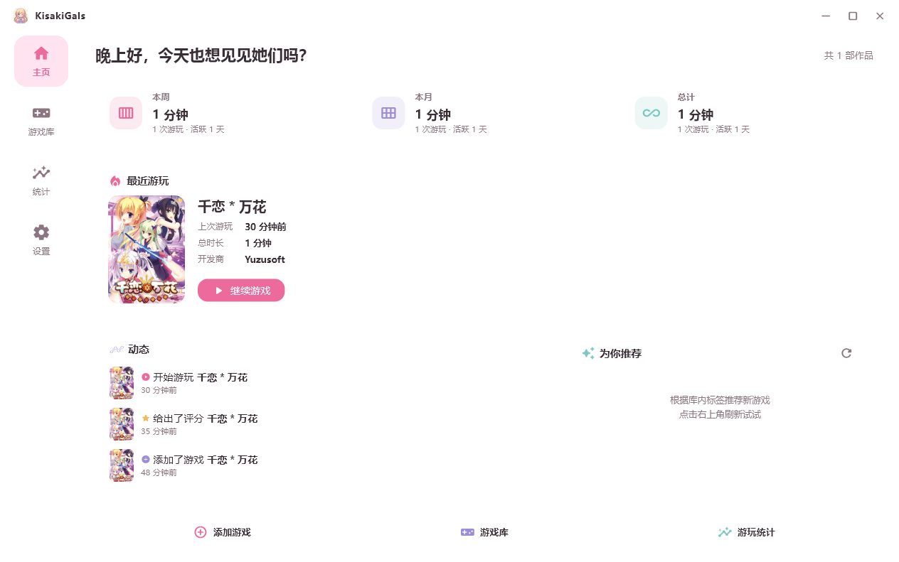
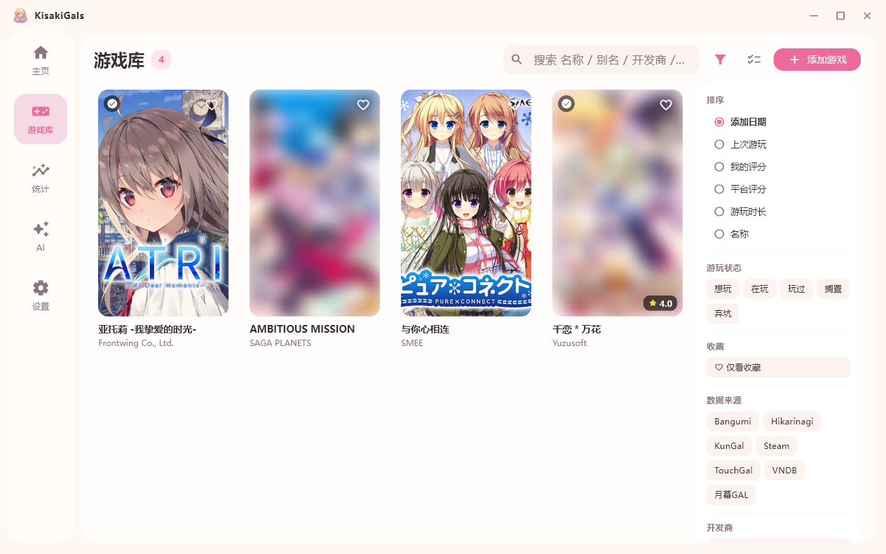
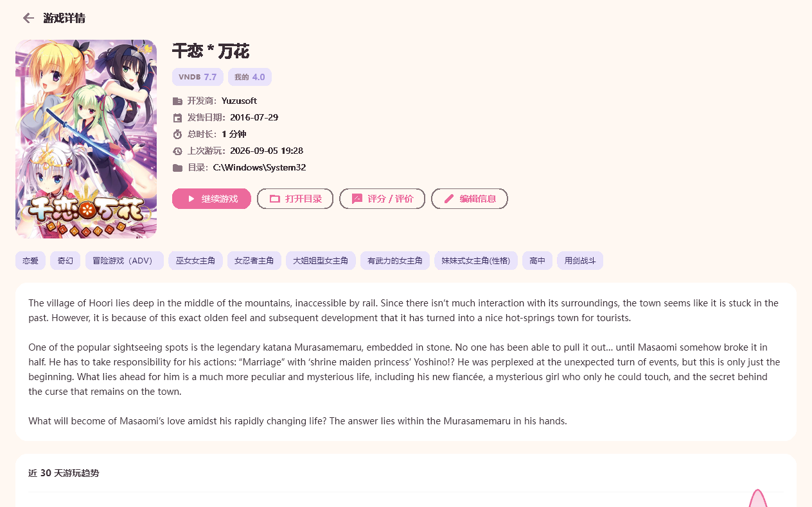
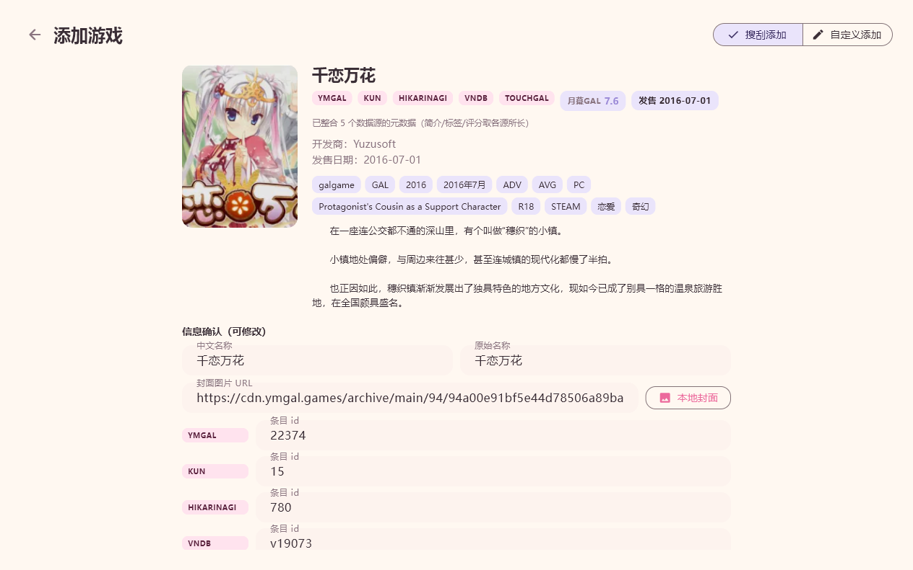
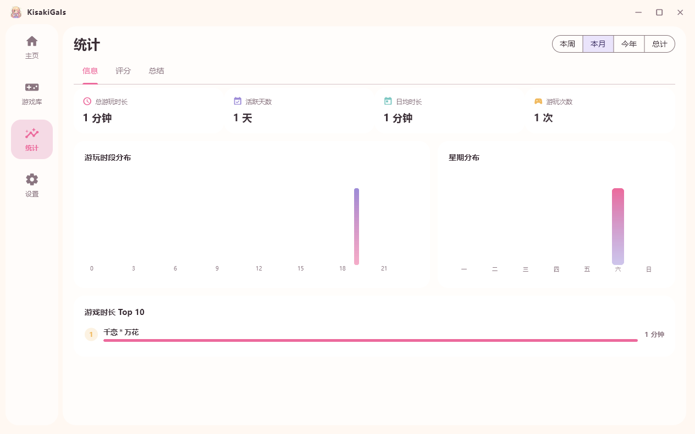
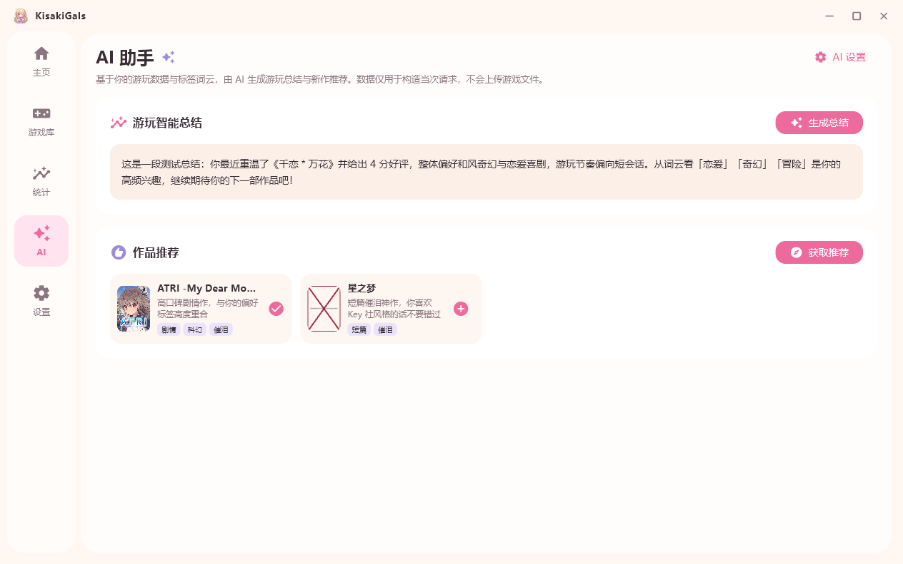
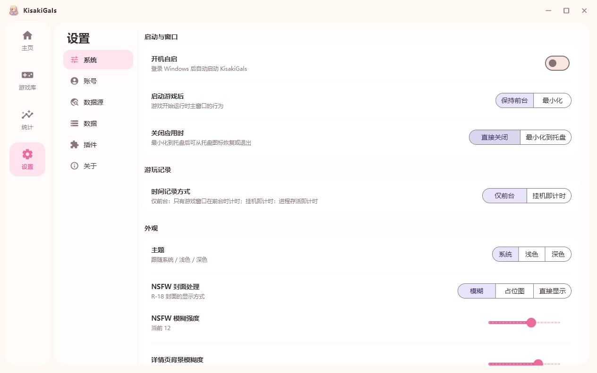
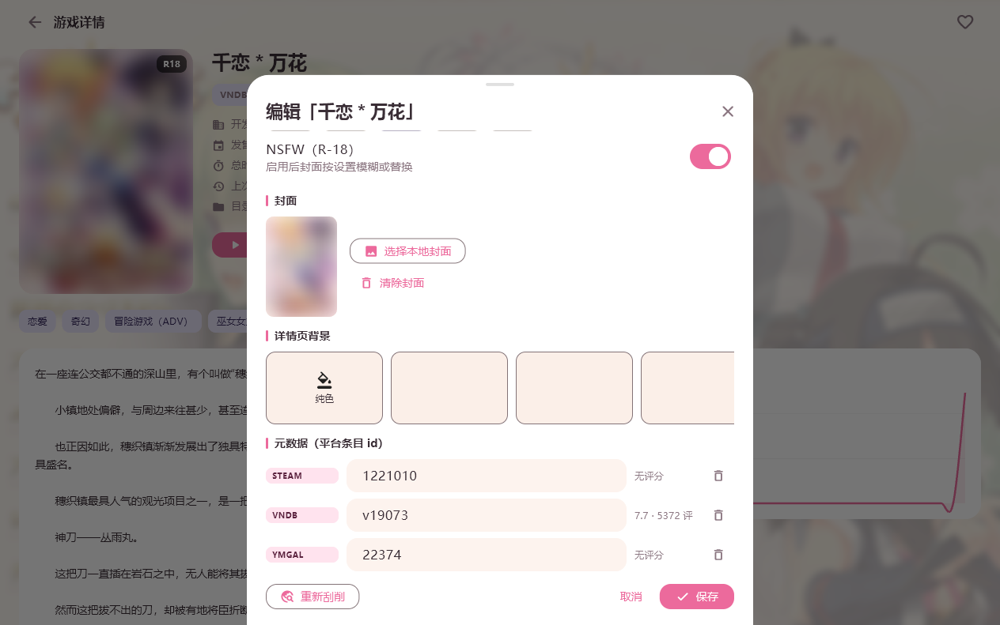

<div align="center">

# 🌸 KisakiGals

**Galgame 收藏与游玩时长管理器** · Flutter Windows 桌面应用

> 「无论何时，都想与她们再次相见。」

**当前版本：0.9.0-beta** ｜ 作者：MusaLunar ｜ [项目主页](https://github.com/MusaLunar/KisakiGals)

[](https://www.gnu.org/licenses/agpl-3.0)

</div>

---

## ✨ 功能一览

| 模块 | 说明 |
| --- | --- |
| 🏠 **主页** | 统计速览（本周/本月/总计）、最近游玩快速继续、动态时间线、为你推荐，固定一屏布局 |
| 📚 **游戏库** | 自适应网格 + 右侧筛选边栏（排序/状态/收藏/来源/开发商/标签，可开关）+ 右键菜单 + 批量管理（改状态/收藏/删除） |
| 📊 **统计** | 信息/评分/总结三页 × 本周/本月/今年/总计：时段分布、星期分布、词云、月度热力 |
| 🤖 **AI 助手** | 结合游玩数据与标签词云生成**智能总结**与**作品推荐**，推荐卡片一键搜刮入库（支持任意 OpenAI 兼容端点） |
| ⚙️ **设置** | 系统（主题/NSFW/关闭行为/托盘）、账号（Bangumi/VNDB/Hikarinagi Token 与**云端同步**）、数据源、AI、数据（备份/恢复）、插件、关于 |
| ➕ **添加游戏** | 拖拽 exe 自动搜刮 / 关键词搜索：**9 个数据源并发**、跨源身份分组、多源元数据整合、封面与详情背景可视化选择（均缓存到本地） |

### 游玩时长监控
- 秒级进程轮询 + 前台窗口检测（仅前台 / 挂机即计时双模式）
- 会话自动落库，驱动全部统计与动态
- 最小化到托盘后继续计时，崩溃可恢复

### 元数据刮削（9 源并发）
Bangumi · VNDB · 月幕GAL(Ymgal) · Hikarinagi · Steam · KunGal · TouchGal · DLsite · CnGal

- 智能匹配打分（别名/符号归一化），每源限流 + 24h 磁盘缓存
- **跨源整合**：同一游戏的多源条目分组展示，合并简介/标签/截图/各平台评分
- 封面、截图、详情背景一键缓存到本地 `covers/`
- 标签英译中（VNDB 标签中文化资源）

### 评分与云同步
- 本地评分（五星 × 10 分制）+ 评论，可同步 Bangumi 收藏、VNDB 游玩列表、Hikarinagi 评价
- 账号页配置 Token 后可**拉取云端记录**回填游玩状态与评分

### 其他
- 右侧滚动通知卡片（替代底部 SnackBar）
- 每日自动备份（可指定任意路径导出，便于跨机迁移）；恢复前自动校验并重启
- 托盘图标：左键唤起、右键菜单（打开/退出）
- 明暗双主题 + Mica 毛玻璃；NSFW 封面 模糊/占位/显示 三种模式（实时生效）
- 插件系统：久坐提醒内置，外部清单可导入

---

## 📸 截图

| | |
| --- | --- |
|  |  |
|  |  |
|  |  |
|  |  |

---

## 🚀 快速开始

### 方式一：便携版（推荐体验）
下载 `KisakiGals-<version>-portable.zip`，解压后直接运行 `kisakigals.exe`。
数据（数据库/封面/缓存/备份）保存在 exe 同目录的 `data/`，整个文件夹拷走即迁移。

### 方式二：安装包
运行 `KisakiGals-<version>-setup.exe`，按向导安装；卸载时保留 `data/` 数据目录。

> ⚠️ 需要 **Windows 10 1809+**（Windows 11 可获得 Mica 毛玻璃效果）。
> 首次启动若杀毒软件拦截，请添加信任（应用为本地自编译，无任何网络上传行为，除你主动配置的 AI/刮削请求外）。

---

## 🛠️ 从源码构建

环境：Flutter 3.x stable（Windows 桌面）+ Visual Studio 2022（C++ 桌面工作负载）

```bash
flutter pub get
flutter build windows --release
# 产物：build\windows\x64\runner\Release\kisakigals.exe
```

测试与静态检查：

```bash
flutter analyze        # 0 issues
dart test              # 13 项单元测试
```

---

## ⚙️ 使用提示

- **AI 配置**：设置 → AI → Base URL / API Key / 模型（OpenAI、DeepSeek、通义、Ollama、LM Studio 等任意兼容端点），测试通过后到「AI」页生成总结与推荐
- **搜刮**：游戏库右上「添加游戏」→ 拖入 exe 或输入名称 → 分组结果中确认 → 可调封面/各源 ID/背景 → 入库
- **重刮/换封面**：详情页「编辑信息」分区化管理
- **快捷键**：游戏中前台自动计时；F10 为开发者截图（debug 构建）
- **备份迁移**：设置 → 数据 → 「备份到…」选择任意路径 → 在另一台电脑「从文件恢复…」

---

## 🧩 灵感与致谢（Inspiration）

本项目深度参考了以下开源项目，特此致谢：

| 项目 | 作者 | 参考内容 |
| --- | --- | --- |
| [ChronoTide] (https://github.com/hardman1314/-Chrono.Tide-) | hardman1314 | 多源元数据刮削架构、VNDB 标签中文化资源（MIT，见下）、Hikarinagi 凭据流程、限流策略 |
| [ReinaManager] (https://github.com/huoshen80/ReinaManager) | huoshen80 | 数据源适配层与 OAuth 账号体系、Token 获取入口、多源元数据整合思路、界面视觉风格启发 |
| [LunaBox] (https://github.com/Saramanda9988/LunaBox) | Saramanda9988 | Go 侧元数据服务实现对照（元数据调度、代理解析） |

**特别说明**：`assets/data/vndb_tags_zh_cn.json`（VNDB 标签英→中翻译表，约 3000 条）来自 ChronoTide 项目

元数据与搜索能力来自以下社区 API / 站点（各站点数据版权归其自身与投稿者所有）：Bangumi、VNDB、月幕GAL、Hikarinagi、Steam、KunGal、TouchGal、DLsite、CnGal。

---

## 📜 许可

- 应用源码：本项目以 **GNU Affero General Public License v3.0（AGPL-3.0）** 发布（见 LICENSE）。
- `assets/data/vndb_tags_zh_cn.json`（第三方内置资源）：MIT © ChronoTide 项目，按 MIT 条款使用。
- 应用图标与界面为原创设计（樱花粉 × 藤紫 × 奶油）。

**本项目与任何商业 galgame 发行商无关，仅供学习与个人管理使用；请在尊重各作品版权的前提下使用。**

---

<div align="center">
Made with Flutter & ♥ · KisakiGals v0.9.0-beta
</div>
